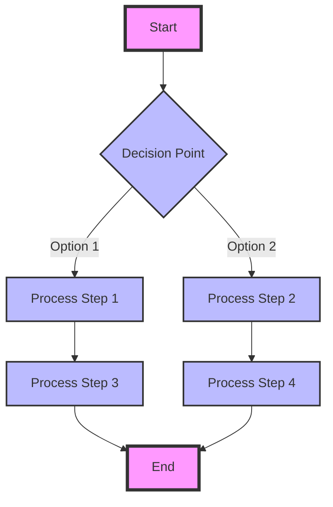

# Solidity LLM Subnet

This subnet generates Solidity code for agents to interact and deploy, ultimately enabling an autonomous economic agent space.

## Setup

The setup involves the following steps:

1. Setup wallets and funds
2. Create subnet
3. Run Miners and Validators
4. Run Validator API

### Prerequisite

Dependencies:

- Rust and Cargo
- Python3
- pip
- btcli
- make
- Docker
- Foundry

Foundry

```
curl -L https://foundry.paradigm.xyz | bash

foundryup
```

Setup virtual env:

```
python3 -m venv .venv
source .venv/bin/activate

pip3 install -r requirements.txt
```

### 1. [For Local Devnet] Run Local Bittensor Devnet

Clone blockchain node:

```
git clone https://github.com/opentensor/subtensor.git
cd subtensor
```

Setup rust and build:

```
./scripts/init.sh
cargo build --release --features pow-faucet
```

> `--features pow-faucet` enables `btcli wallet faucet`

Run local devnet with build disabled as it's done in previous step:

```
BUILD_BINARY=0 ./scripts/localnet.sh
```

Now a websocket should be opened at the following port: `ws://127.0.0.1:9947`

### 2. Setup Wallet and get funds

3 wallets are required:

- Owner wallet: account that controls subnet
- validator wallet
- miner wallet

```
btcli wallet new_coldkey --wallet.name owner # owner wallet

# miner cold and hot wallet
btcli wallet new_coldkey --wallet.name miner
btcli wallet new_hotkey --wallet.name miner --wallet.hotkey default

# validator cold and hot wallet
btcli wallet new_coldkey --wallet.name validator
btcli wallet new_hotkey --wallet.name validator --wallet.hotkey default
```

Now we have the wallets, we will mint tokens from the faucets.
To spin up a subnet, the owner requires `τ1000`.
The following command funds the owner account `τ300` from the faucet:

```
btcli wallet faucet --wallet.name owner --subtensor.chain_endpoint ws://127.0.0.1:9947
```

So the command will have to be ran a minimum of 4 times.
Then fund the miners and validators as it costs `τ1` to register to a subnet.

```
btcli wallet faucet --wallet.name miner --subtensor.chain_endpoint ws://127.0.0.1:9947
btcli wallet faucet --wallet.name validator --subtensor.chain_endpoint ws://127.0.0.1:9947
```

You can check the balance of your addresses with:

```
btcli wallet balance --all --subtensor.chain_endpoint ws://localhost:9947 --subtensor.network local
```

### 3. Create subnet

Run the following to create a subnet using the owner's wallet:

```
btcli subnet create --wallet.name owner --subtensor.chain_endpoint ws://127.0.0.1:9947
```

### 4. Run Miners and Validators

Before running the miners and validators, we'd need to register the miners and validators to the subnet:

```
btcli subnet register --wallet.name miner --wallet.hotkey default --subtensor.chain_endpoint ws://127.0.0.1:9947
btcli subnet register --wallet.name validator --wallet.hotkey default --subtensor.chain_endpoint ws://127.0.0.1:9947
```

> Note: If you're running locally, make sure to set different `--axon.port` and `--axon.external_port` for each nodes.
> For example, looking at `Makefile`, we can see that the validator runs on port `8091` and miner runs on port `8092`.

Add the stake:

```
btcli stake add --wallet.name validator --wallet.hotkey default --subtensor.chain_endpoint ws://127.0.0.1:9947
```

> Note: This step bootstraps the incentives on your new subnet by adding stake into its incentive mechanism.

Now you can validate that both miner and validator are registered:

```
btcli subnet list --subtensor.chain_endpoint ws://127.0.0.1:9947
```

The output should be something like:

```
                                              Subnets - local
 NETUID   N    MAX_N   EMISSION  TEMPO  RECYCLE     POW    SUDO
   0      0    64.00    0.00%     100   τ1.00000  10.00 M  5C4hrfjw9DjXZTzV3MwzrrAr9P1MJhSrvWGWqi1eSuyUpnhM
   1      2    256.00   0.00%     360   τ1.00000  10.00 M  5Fc69hShKsmDZRG7Q1VBENDEZ3Ua2qDURZqnFje5eHVGJdiu
   3      0    4.10 K   0.00%     99    τ1.00000  10.00 M  5C4hrfjw9DjXZTzV3MwzrrAr9P1MJhSrvWGWqi1eSuyUpnhM
   3     4416
```

> A succesful run should show 2 N in NETUID 1.

### [Alternatively] Docker Setup: Build and Run:

To build and run the miner, use:

```
make build-miner-docker
make run-miner-local
```

To build and run the validator, use:

```
make build-validator-docker
make run-validator-local
```

To build and run the `validator_api`, use:

```
make build-validator-api-docker
make run-api-local
```

### Register the wallets on root subnet

Lastly, register the validator on the root subnet and boost to set weights for your subnet so subnet receives emissions.

```
btcli root register --wallet.name validator --wallet.hotkey default --subtensor.chain_endpoint ws://127.0.0.1:9947
btcli root boost --netuid 1 --increase 1 --wallet.name validator --wallet.hotkey default --subtensor.chain_endpoint ws://127.0.0.1:9947
```

Now you can verify that the incentive system works:

```
btcli wallet overview --wallet.name validator --subtensor.chain_endpoint ws://127.0.0.1:9947
btcli wallet overview --wallet.name miner --subtensor.chain_endpoint ws://127.0.0.1:9947
```

## Run the API

```
python3 neurons/validator_api.py --netuid 1 --subtensor.chain_endpoint ws://127.0.0.1:9947 --wallet.name validator --wallet.hotkey default
```

Test out it works by visiting: `localhost:8000/docs`

Or you can run against the API:

```
curl -X 'POST' \
  'http://localhost:8000/api/generate' \
  -H 'accept: application/json' \
  -H 'Content-Type: application/json' \
  -d '{
  "prompt_text": "test"
}'
```

# Docker Setup

View the `Makefile` for local usage.

# My Project

This is an example of a Mermaid diagram in a GitHub README.


